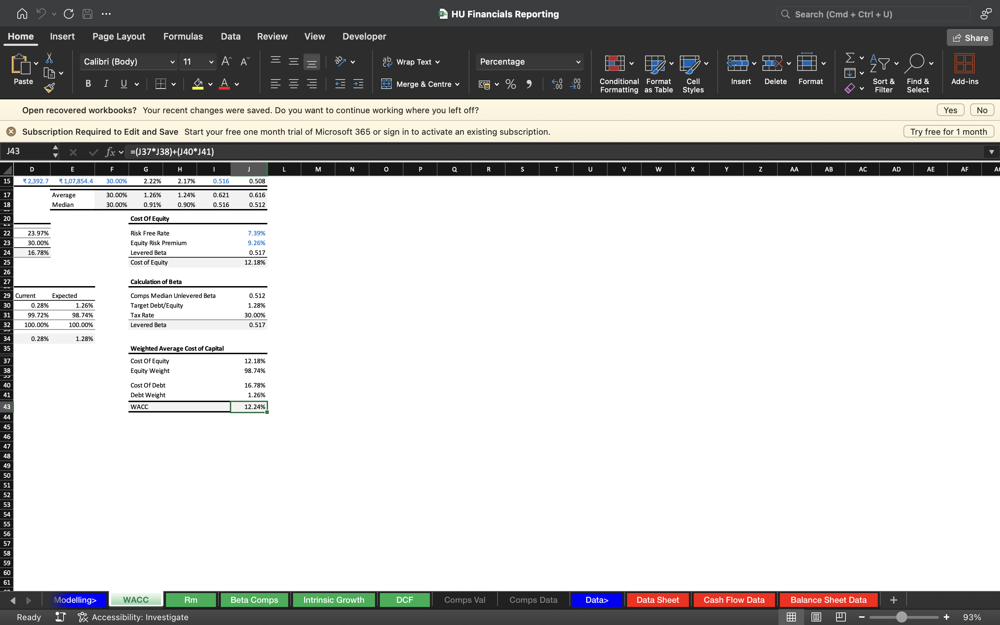
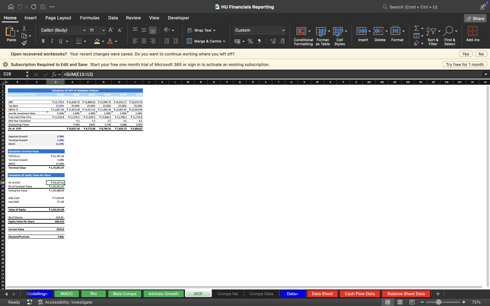

# Hindustan Unilever Financial Modeling & Valuation

## Project Overview

Built a comprehensive **Discounted Cash Flow (DCF) Financial Model** for **Hindustan Unilever Limited (HUL)** using Microsoft Excel. The model forecasts the company's financial performance, estimates Free Cash Flow to Firm (FCFF), calculates the Weighted Average Cost of Capital (WACC), determines Enterprise Value, and estimates the intrinsic value using DCF valuation.

---

## Business Objective

The objective of this project is to estimate the intrinsic value of Hindustan Unilever by forecasting future financial performance and applying industry-standard valuation techniques to support investment decisions.

---

## Tools & Techniques

- Microsoft Excel
- Financial Modeling
- Discounted Cash Flow (DCF)
- Free Cash Flow to Firm (FCFF)
- Weighted Average Cost of Capital (WACC)
- Financial Statement Analysis
- Intrinsic Valuation
- Forecasting

---

## Repository Contents

- Financial Model (Excel)
- Historical Financial Data
- Balance Sheet Analysis
- Cash Flow Analysis
- WACC Calculation
- Intrinsic Growth Analysis
- DCF Valuation

---

## Financial Model Preview

### Data Sheet

---

### Balance Sheet

---

### Cash Flow Analysis

---

### WACC Calculation

---

### Intrinsic Growth Analysis

---

### DCF Valuation

---

## Model Components

- Historical Financial Statement Analysis
- Revenue Forecasting
- Operating Expense Forecasting
- FCFF Calculation
- WACC Estimation
- Terminal Value Calculation
- Enterprise Value Estimation
- Equity Valuation
- Intrinsic Value Analysis

---

## Key Outputs

- Forecasted Financial Statements
- Free Cash Flow to Firm (FCFF)
- Weighted Average Cost of Capital (WACC)
- Terminal Value
- Enterprise Value
- Equity Value
- Intrinsic Share Price

---

## Skills Demonstrated

- Financial Modeling
- Corporate Finance
- Equity Valuation
- Business Valuation
- Financial Statement Analysis
- Financial Forecasting
- Investment Analysis
- Microsoft Excel

---

## Author

**Aaranya**
